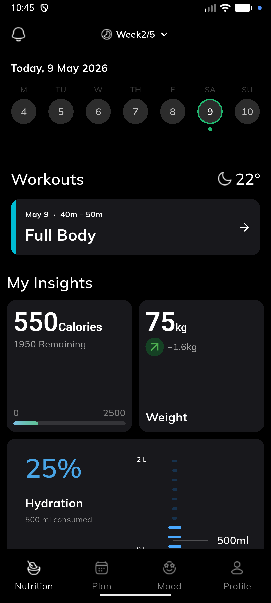
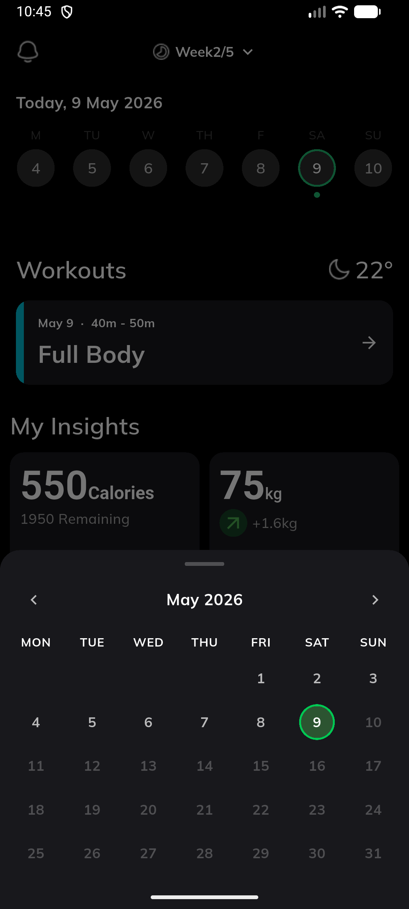
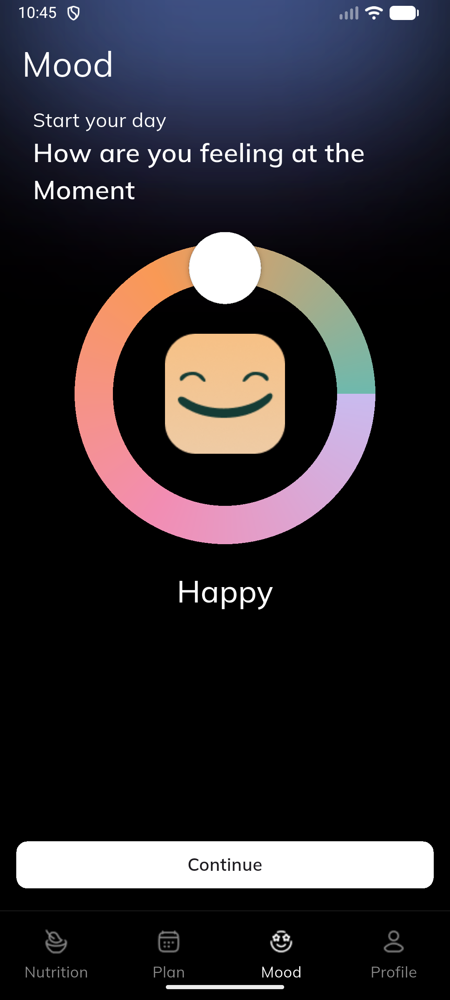
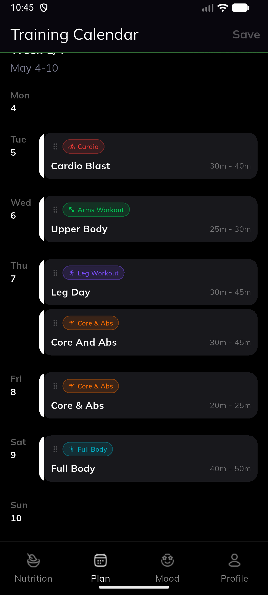

# Hero App

A Flutter fitness/workout application that includes workout tracking, calendar scheduling, mood tracking, and weather integration.

---

# Dependencies Used & Why

## Core Dependencies

### Flutter
Used as the main framework for building the cross-platform mobile application.

### Dart
Programming language used to develop the application.

---

## Packages & Plugins

### http `^1.6.0`
Used for making HTTP requests and API calls.

**Why it was necessary:**
- Fetch weather data from external APIs.
- Handle network communication within the app.

---

### geolocator `^14.0.2`
Used to access the device’s location services.

**Why it was necessary:**
- Retrieve the user’s current location.
- Provide location-based weather information.

---

# Project Structure

```text
lib/
├── components/
├── controllers/
│   └── date_controller.dart
├── models/
│   ├── day_slot.dart
│   ├── workout_card.dart
│   └── workout_data.dart
├── pages/
│   ├── home_page.dart
│   ├── mood_page.dart
│   ├── profile_page.dart
│   └── training_calendar_page.dart
├── services/
│   └── weather_service.dart
├── utils/
│   ├── data.dart
│   └── helpers.dart
└── main.dart
```

---

# Folder Explanation

## `components/`
Contains reusable UI widgets and shared interface components used throughout the application.

Examples:
- Custom cards
- Buttons
- Reusable layouts
- Shared UI elements

---

## `controllers/`
Contains application logic and state-related functionality.

### `date_controller.dart`
Handles selected dates and calendar-related logic.

---

## `models/`
Contains data models used across the application.

### `day_slot.dart`
Represents daily workout or time slot data.

### `workout_card.dart`
Defines workout card structure and information.

### `workout_data.dart`
Stores workout-related data models.

---

## `pages/`
Contains all main application screens/pages.

### `home_page.dart`
Main dashboard/home screen.

### `mood_page.dart`
Mood tracking screen.

### `profile_page.dart`
User profile screen.

### `training_calendar_page.dart`
Workout/training calendar interface.

---

## `services/`
Contains external services and API-related logic.

### `weather_service.dart`
Handles weather API requests and location-based weather fetching.

---

## `utils/`
Contains helper functions, constants, mock data, and reusable utility methods.

### `data.dart`
Static/mock data used in the application.

### `helpers.dart`
Common helper methods and utility functions.

---

## `main.dart`
Application entry point.

**Responsibilities:**
- Initializes the app
- Configures themes and global settings
- Launches the main application widget

---

# Features

- Workout scheduling
- Training calendar
- Mood tracking
- Weather integration
- Profile management
- Reusable UI components
- Date-based workout organization

---


# Screenshots

| Home Screen | Training Calendar |
|---|---|
|  |  |

| Mood Page | Profile Page                                    |
|---|-------------------------------------------------|
|  |  |

---

# App Recording

[▶ Watch App Demo](screenshots/recording.webm)

# Getting Started

## Install dependencies

```bash
flutter pub get
```

## Run the application

```bash
flutter run
```

---

# Author

Developed as a Flutter interview test task by Ahmad Hassan